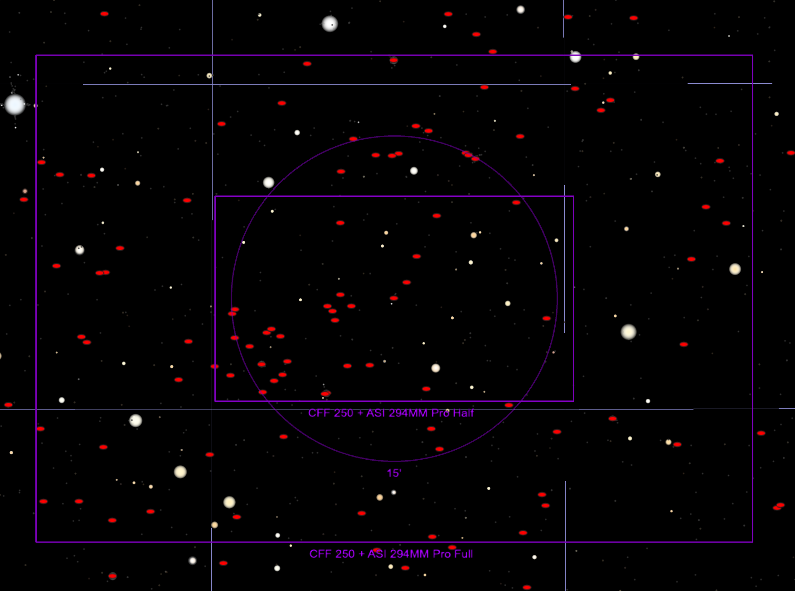
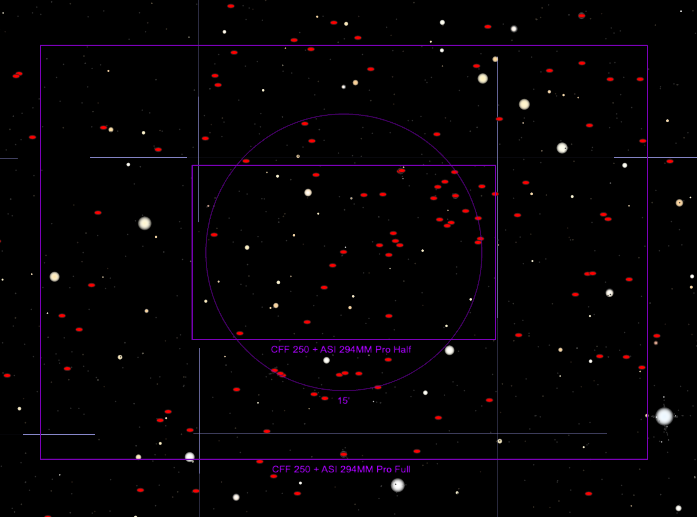

## ZTF24aagssbr Target Information

Back to [Index](../index.html)

### Interesting Features

* In a redshift 0.056 galaxy in Ursa Major, 2MASX+J11082310%2B4358032 aka LEDA 2233429 aka PGC 2233429

### Discovery and Finder Charts

* [ALeRCE ZTF Explorer](https://alerce.online/object/ZTF24aagssbr)

*TheSkyX Finder Chart*

*TheSkyX Finder Chart with North Down*

