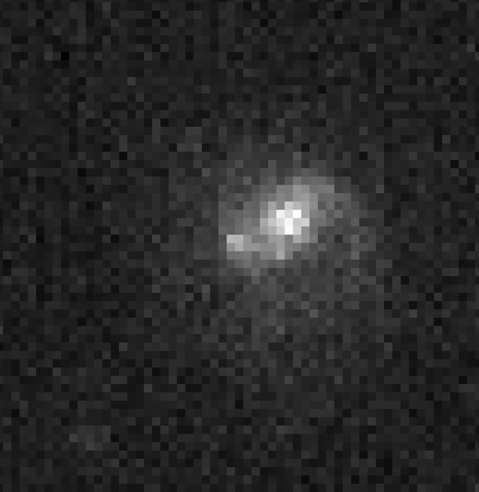

## ZTF24aagtmbq Target Information

Back to [Index](../index.html)

### Interesting Features

* [ALeRCE ZTF Explorer](https://alerce.online/object/ZTF24aagtmbq)

#### Positives

* In a redshift 0.03 spiral galaxy, WISEA J143808.93+201024.9 aka LEDA 1618851 aka PGC 1618851
* located in a spiral arm, well away from the galaxy center

#### Negatives

* Rises late, probably cannot get worthwhile images until 11pm local time, at which time it is at 22&deg; altitude and 81&deg; azimuth

### Discovery and Finder Charts

*Discovery Image*

*TheSkyX Finder Chart*

*TheSkyX Finder Chart with North Down*

### Observations

* March 13 (UTC)?
