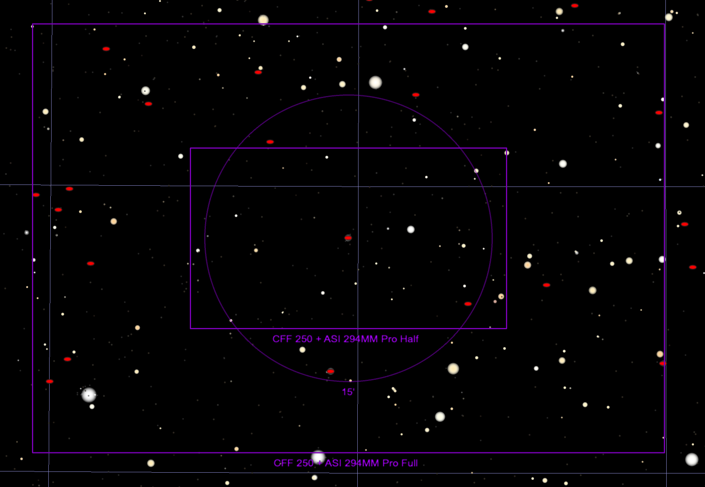

## ZTF24aagupsf

Back to [Index](../index.html)

### Features

* [ALeRCE ZTF Explorer](https://alerce.online/object/ZTF24aagupsf)

#### Positives

* In a redshift 0.03 spiral galaxy, CGCG 224-062, aka PGC 58391
* located well away from the galaxy center

#### Negatives

* Rises late, probably cannot get worthwhile images until 1am local time

### Discovery and Finder Charts

*Discovery Image*

*TheSkyX Finder Chart*

### Observations (UTC)

* March 19
