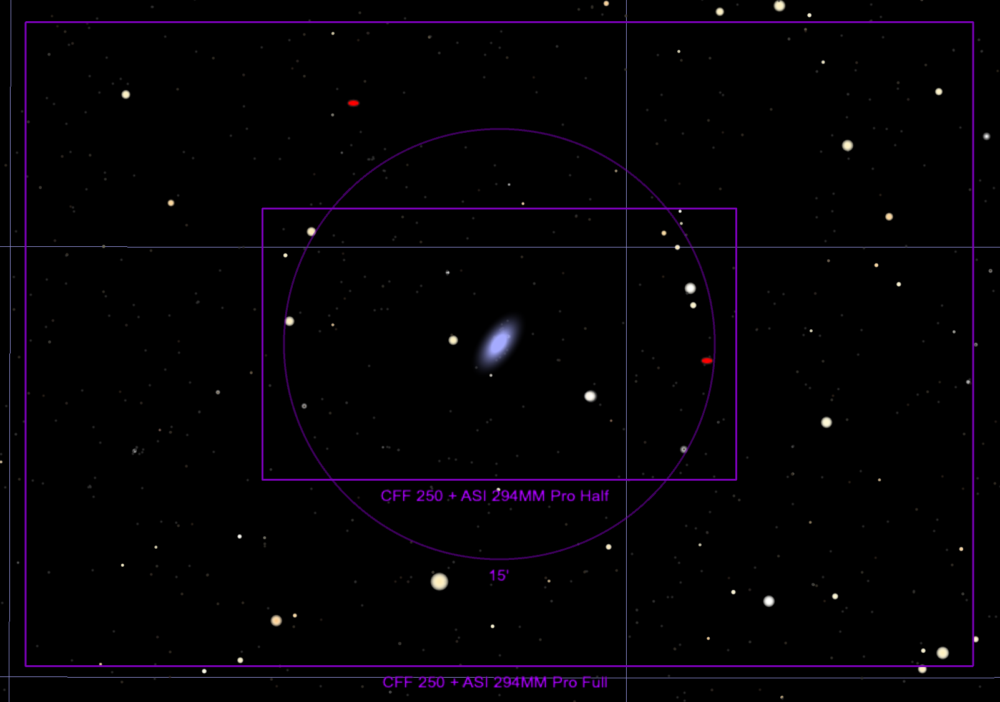

## ZTF24aahgqwk

Back to [Index](../index.html)

### Features

* [ALeRCE ZTF Explorer](https://alerce.online/object/ZTF24aahgqwk)

#### Positives

* In a redshift 0.003 spiral galaxy, NGC 3443

#### Negatives

* located pretty near the galaxy center, maybe hard to isolate or bogus

### Discovery and Finder Charts

*Discovery Image*

*TheSkyX Finder Chart*

*TheSkyX Finder Chart*

