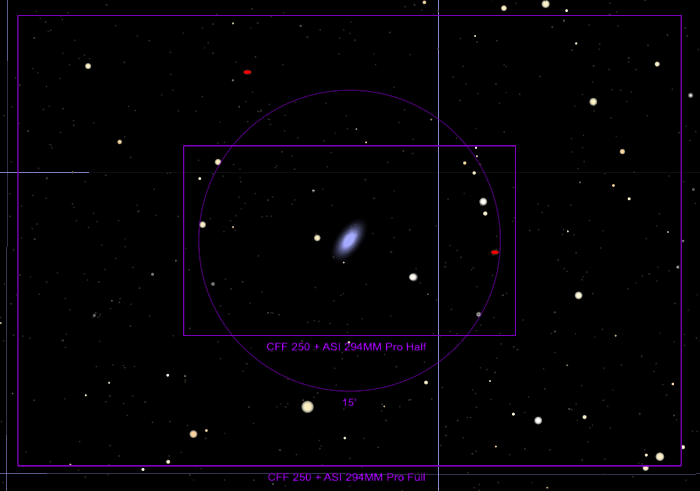
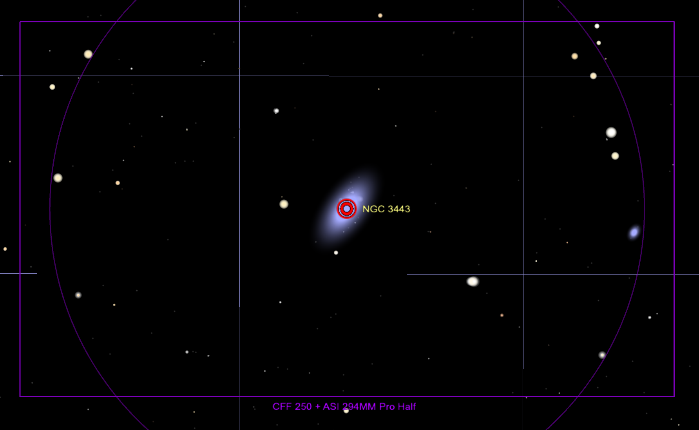

## ZTF24aahgqwk

Back to [Index](../index.html)

### Features

* [ALeRCE ZTF Explorer](https://alerce.online/object/ZTF24aahgqwk)

#### Positives

* In a redshift 0.003 spiral galaxy, NGC 3443

#### Negatives

* located pretty near the galaxy center, maybe hard to isolate or bogus

### Discovery and Finder Charts

*Discovery Image*

*TheSkyX Finder Chart*

*TheSkyX Finder Chart*

### Observations (UTC)

* March 20, observed and despite the waxing gibbous moon being nearby, it was so bright it was obvious, did 60 of 30-second r exposures, and then 60 of 30-second g exposures, all half-subframed and binned 3x3
* March 21, was able to observe despite thin clouds forming -- the images were done 30 red, 30 green, 30 red, 30 green rather than the usual 60 red 60 green, because of concern that the clouds would prevent any of the later images from being taken, but in fact, most of the images are ok, except possibly near the end some are useless
* March 23, 96% full moon is only 6&deg; from the target, but happily, the supernova is still bright enough to observe, we had to jog the telescope 5 arc-minutes to the left (5' increase in RA)
