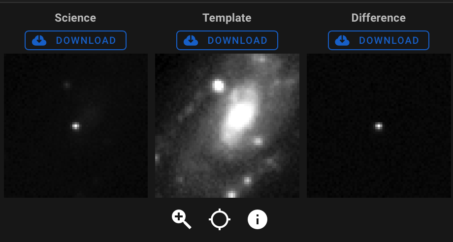

## ZTF24aahgqwk

Back to [Index](../index.html)

### Features

* [ALeRCE ZTF Explorer](https://alerce.online/object/ZTF24aahgqwk)

#### Positives

* In a redshift 0.003 spiral galaxy, NGC 3443

#### Negatives

* located pretty near the galaxy center, maybe hard to isolate or bogus

### Discovery and Finder Charts

*Discovery Image*

*TheSkyX Finder Chart*

*TheSkyX Finder Chart*

### Observations (UTC)

* March 20, observed and despite the waxing gibbous moon being nearby, it was so bright it was obvious, did 60 of 30-second r exposures, and then 60 of 30-second g exposures, all half-subframed and binned 3x3
* March 21, *plan* to take calibration images if it is cloudy, or continue observation if it is clear
* MOON IS ESPECIALLY BAD ON 22ND AND 23RD (UTC)
