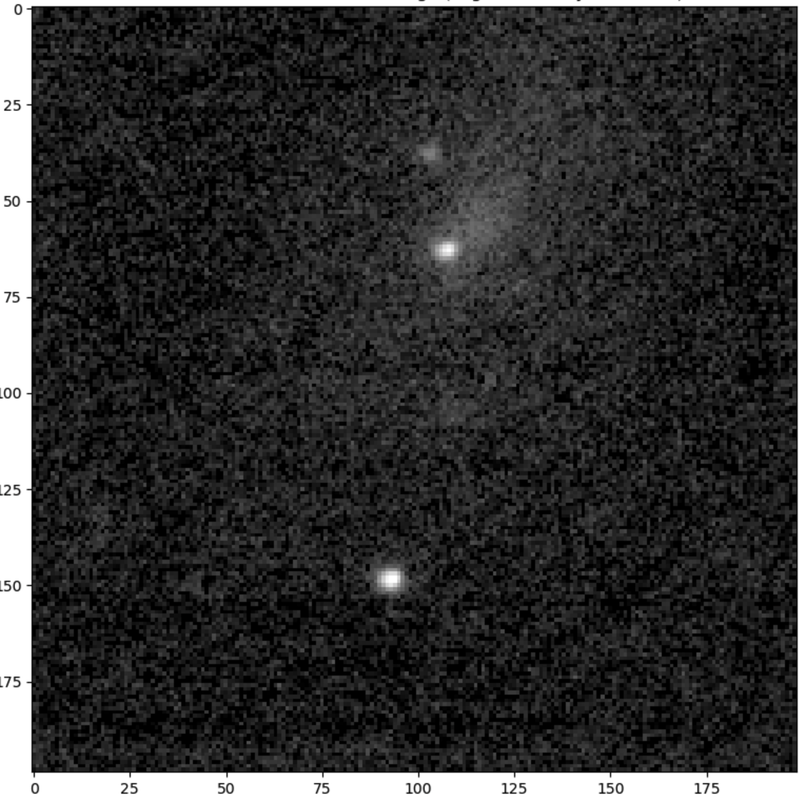

# Supernova Observation

## Syllabus

* [Syllabus](./syllabus.html)

## Target Selection Links

1. Supernovae identified by the Zwicky Transient Facility (ZTF) are within our grasp. Supernovae have various brightnesses with the brightest ones having peak luminosity brighter than magnitude 17. A pre-digested list of supernovae is the Rochester Astronomy of Science's [compendium](https://www.rochesterastronomy.org/supernova.html).
2. However, generally, we don't want to wait for a candidate to appear in a compendium, so we use the [ALeRCE search tool for ZTF candidates](https://alerce.online/?selectedClassifier=stamp_classifier&selectedClass=SN&probability=0.65&ndet=1&ndet=3157&ranking=1&firstmjd=60378&count=false&page=1&perPage=20)
3. Or sometimes another ALeRCE tool, [Supernovae Hunter search](https://snhunter.alerce.online)
4. One more place to hunt for candidates is the [IAU Transient Name Server](https://www.wis-tns.org/search) because it gets candidates from sources, such as the ATLAS collaboration

##  Random Notes

1. LEDA identifiers are often the same as PGC identifiers
2. For accessing photos of the target region, use [this resource](https://skyview.gsfc.nasa.gov/current/cgi/query.pl) and select DSS2 Red

## Observation Log

### Week of March 18

* Work on internet at Henderson (successfully fixed)
* Work on internet at seismic (successfully fixed, and we have internet at the observatory again)
* Re-do collimation (did everything but back-focus)
* Get the video work with the Celestron done
* March 19 (UTC) observe [ZTF24aagupsf](./analyses/ZTF24aagupsf/index.html) in PGC 58391, too dim

## ZTF24aahgqwk Observation Log Moved

* [ZTF24aahgqwk Observation Log](./analyses/ZTF24aahgqwk/ZTF24aahgqwk-observation_log.html)

## Other Observatory Logs for this period

### Week of March 25

* March 25 Make mini-desk for laptop in dome, and install monitor, 2.4GHz mouse, and keyboard
* March 26 Re-do cabling now with laptop on mini-desk in dome
* March 26 Re-do sky model, because the last two observing runs, the target has been observed to be 5 arcminutes displaced
* March 26 Need to operate laptop from dome because keyboard and mouse re-location doesn't work
* March 27 Head to New Mexico for installation of telescope at Dark Sky NM

### Week of April 7

* April 8 Sky model again

### Term 6 &mdash; Continuation of Analysis

 * [ZTF24aahgqwk Observation Log](./analyses/ZTF24aahgqwk/ZTF24aahgqwk-observation_log.html)
 * [ZTF24aahgqwk Calibration, Alignment, and Stacking Notebook](./analyses/ZTF24aahgqwk/ZTF24aahgqwk-calibration.ipynb)
  * For convenience, [PDF of ZTF24aahgqwk Calibration, Alignment, and Stacking Notebook](./analyses/ZTF24aahgqwk/ZTF24aahgqwk-calibration.pdf)
 * [ZTF24aahgqwk Photometry and Light Curve Notebook](./analyses/ZTF24aahgqwk/ZTF24aahgqwk-light_curve.ipynb)
  * For convenience [PDF of ZTF24aahgqwk Photometry and Light Curve Notebook](./analyses/ZTF24aahgqwk/ZTF24aahgqwk-light_curve.pdf) 
* Make plan for uploading passovers to YouTube
 * [First passover uploaded](https://youtu.be/EfwUompp8xY)
 
## ZTF24aahgqwk
 
ZTF24aahgqwk on 2024-03-20 in Sloan r. A long time ago in a galaxy far, far away.
 

